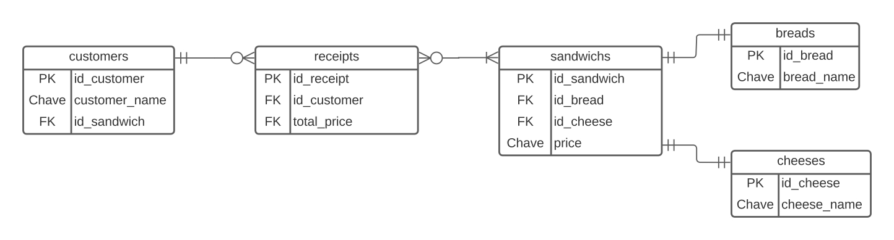

# LaPadarie

O projeto se baseia na construção de um sistema voltado para uma padaria fictícia que trabalha com sanduíches específicos.

## Tecnologias

- Node.js
- Express
- Typescript
- MySQL

## Como iniciar

Para iniciar o projeto na sua máquina:

1. `git clone` para clonar
2. `npm install` ou a sua alternativa de gerenciador de pacotes, para instalar todas as depedências **(recomendo consultar o arquivo package.json)**
3. Criar o seu próprio **.env** com as chaves para conexão com o banco de dados MySQL
4. `yarn start` para inicializar o servidor
